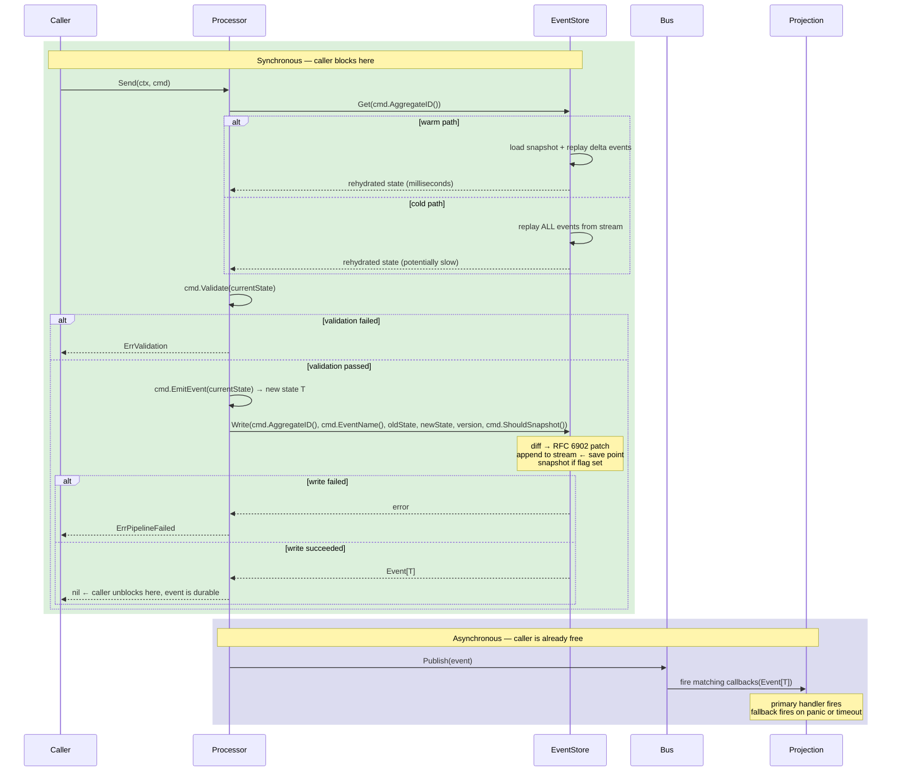

# What is Asynx

Asynx is an event sourcing + CQRS framework for Go. Developers express intent through commands — Asynx handles events, state, and history automatically. Bring your infrastructure, Asynx handles the rest.

---

## Philosophy

Most event sourcing frameworks fail developers by making them think in events. Asynx flips that — developers think in commands, Asynx handles events internally. Events in Asynx are not something the developer defines or emits directly. They are the CDC (Change Data Capture) diff of an aggregate's state, produced automatically by Asynx after a command succeeds.

The "bring your own" philosophy extends beyond the store — the bus and the store are all pluggable interfaces. Asynx ships sensible defaults for each. Developers swap them out only when their infrastructure demands it.

Asynx makes no consistency guarantees beyond what your Store implementation provides. If you bring a strongly consistent store, you get strong consistency. If you bring an eventually consistent one, that's your choice and your responsibility.

---

## Module Map

### `core`

Foundation. Event envelope, generic type constraints, shared interfaces, and the builder. Zero internal dependencies. Everything else depends on this, this depends on nothing. If a type lives here, every module can use it. Keep this package ruthlessly minimal.

The builder lives here because it is the assembly point for all of Asynx's pluggable contracts — it knows the interfaces, not the implementations. Concrete implementations (`bus`) live in their own sub-packages and are passed into the builder by the developer. `core` never imports them.

#### `Event[T]`

The event envelope is the central type in `core`. It carries both the old and new aggregate state — the CDC diff is computed by Asynx internally for storage purposes only and never exposed through this type.

```go
type Event[T any] struct {
    ID                string
    AggregateID       string
    EventName         string
    Version           int64
    SchemaVersion     int     // stamped automatically by processor from WithSchemaVersion()
    OccurredAt        time.Time
    Aggregate         T       // new state
    PreviousAggregate T       // old state
}
```

#### `Bus[T]`

```go
type Bus[T any] interface {
    Publish(ctx context.Context, event Event[T]) error
    Subscribe(pattern string, handler func(Event[T])) (string, error) // returns subscription ID
    Unsubscribe(id string) error
    Close(ctx context.Context) error
}
```

`Publish` is called by Asynx after every committed event. If it returns an error, the event is already safely written to the eventstore — the error signals a dispatch failure only, not a rollback. `Subscribe` returns a string ID the developer holds onto for later `Unsubscribe` calls. Pattern matching supports exact names and regex.

#### Builder

```go
instance, err := asynx.New[Order]().
    WithEventStore(myEventStore).              // required — Build() errors if missing
    WithSnapshotStore(mySnapshotStore).        // required — Build() errors if missing; a SnapshotStore, not a Store
    WithBus(myBus).                            // optional — defaults to in-process channel bus
    WithShardingOpts(asynx.ShardingOpts{
        Shards:     8,
        QueueDepth: 0,
    }).                                        // optional
    WithSchemaVersion(2).                      // optional — defaults to 1
    WithUpcaster(2, func(eventName string, raw []byte) []byte {
        // fix patches written at schema version 1 → 2
        return raw
    }).                                        // optional, one per version transition
    WithPanicHandler(func(e asynx.PanicEvent[Order]) {
        // e.EventName, e.Aggregate, e.Projection, e.Err
        // e.Projection is func(asynx.Event[Order])
    }).                                        // optional
    Build()
```

`Build()` returns `(Instance, error)`. Build-time hard errors: a missing `EventStore` (`ErrMissingEventStore`) or a missing `SnapshotStore` (`ErrMissingSnapshotStore`) — everything else has a safe default. `WithSnapshotStore` cannot default to the event store: `SnapshotStore` is a distinct interface (`Put`/`Get`/`Delete`, one upserted row per aggregate), not a second `Store`.

---

### `command`

The only surface the developer directly interacts with. Each command is a plain Go struct carrying whatever data it needs, with four methods hanging off it.

```go
type Command[T any] interface {
    AggregateID() string
    Validate(current *T) error
    EmitEvent(current *T) T
    EventName() string
    ShouldSnapshot() bool
}
```

Both `Validate` and `EmitEvent` receive a pointer to the current aggregate state. **If `current` is `nil`, the aggregate has never existed.** Commands are responsible for handling this case explicitly — a nil pointer means this is the first command ever sent for this aggregate. Commands that require an existing aggregate should return an error from `Validate` when `current` is nil. Commands that create an aggregate should expect it.

`EmitEvent` receives a pointer but returns a value — never a pointer, never nil. Asynx enforces this: if `EmitEvent` somehow produces a zero value that cannot be diffed meaningfully, that is a programming error in the command, not a recoverable runtime condition.

```go
func (c InstallPackage) AggregateID() string {
    return c.PackageID
}

func (c InstallPackage) Validate(current *Package) error {
    if current == nil {
        return errors.New("package does not exist")
    }
    if current.Status != "available" {
        return errors.New("package is not available for installation")
    }
    return nil
}

func (c AddPackage) AggregateID() string {
    return c.PackageID
}

func (c AddPackage) Validate(current *Package) error {
    if current != nil {
        return errors.New("package already exists")
    }
    return nil // nil is expected — this command creates the aggregate
}
```

**`AggregateID() string`** — identifies which aggregate this command targets. Asynx uses this for shard routing and for loading current state before validation. The aggregate ID is fundamental domain information — a command without a target is not a complete command.

**`Validate(current *T) error`** — answers the question: _is this command legal right now?_ Receives a pointer to the current aggregate state and checks two categories:

- **Command-level validity** — is this command internally coherent regardless of current state? Required fields, value ranges, logical consistency within the command's own data.
- **Domain-level validity** — is this command legal given where the aggregate currently stands? Status checks, business rules, conflict detection.

If either fails, the error is returned synchronously to the developer. The command goes no further.

**`EmitEvent(current *T) T`** — answers the question: _what should the world look like after this command succeeds?_ Receives a pointer to current state, returns a full value — never a pointer, never a partial. Asynx takes it from there — diffing against the previous state, wrapping in an event envelope, committing to the eventstore. If `current` is nil, `EmitEvent` constructs and returns the initial state from scratch.

**`EventName() string`** — the name Asynx uses to identify this event in the eventstore and route it to projection subscribers. Past tense naming is intentional — events describe things that already happened, not things being requested.

```go
func (c AddPackage) EventName() string {
    return "PackageAdded"
}
```

**`ShouldSnapshot() bool`** — a signal to Asynx: after this command's event is committed, should a full state snapshot be taken? The developer knows their domain — they know which commands represent meaningful checkpoints worth snapshotting.

**Commands must:**

- Be pure functions — same inputs always produce same outputs
- Only reason about their own fields and the current aggregate state passed in
- Return a complete value `T` from `EmitEvent`, never a pointer, never a partial or delta
- Handle `nil` current state explicitly in both `Validate` and `EmitEvent`
- Return a stable, non-empty string from `AggregateID()` — this is used for shard routing and must never change for the lifetime of the command

**Commands must not:**

- Perform IO of any kind — no database calls, no HTTP requests, no file reads
- Make cross-aggregate reads inside `Validate` or `EmitEvent`
- Produce side effects of any kind
- Use randomness

Cross-aggregate concerns, external validation, and real-world side effects all belong in the application layer — either before `asynx.Send()` is called, or inside a `projection` callback after the event is committed.

---

### `eventstore`

The single persistence boundary in Asynx. Everything that touches durable storage — reading, writing, caching, hydrating — lives here. The `processor` calls into `eventstore` to get current state and to commit events. It never touches the Store directly.

Internally, `eventstore` is composed of four sub-responsibilities:

#### Sub-module: `reader`

Serves the latest committed state of an aggregate to `processor`. The path taken is determined entirely by what the stores return — no external signal or cache layer is involved.

**Warm path** — a snapshot exists. Asynx loads it as the base state, then replays any delta events written after the snapshot's version on top of it:

```
ReadFrom(snapshotStore, aggregateID, 0)
    ↓ snapshot found
ReadFrom(eventStore, aggregateID, snapshot.version + 1)
    ↓ empty  → snapshot is current, return snapshot state directly
    ↓ entries → replay delta patches on top of snapshot state, return result
```

**Cold path** — no snapshot exists. Asynx replays all events from the beginning of the stream:

```
ReadFrom(snapshotStore, aggregateID, 0)
    ↓ empty
ReadFrom(eventStore, aggregateID, 0)
    ↓ empty   → ErrNotFound — aggregate has never existed
    ↓ entries → replay all patches from scratch, return result
```

The path taken is an internal implementation detail. `processor` calls `eventstore.Get(ctx, aggregateID)` and receives current state. It never knows which path was used.

If the developer wants to accelerate snapshot reads — for example in a high-traffic multi-node deployment — they build a caching layer into their snapshot store implementation. Asynx calls the store interface either way.

Also exposes the **StateView** API — strongly consistent, aggregate-based reads that require no additional infrastructure:

```go
state, err := asynx.Get(ctx, aggregateID)
exists, err := asynx.Exists(ctx, aggregateID)
```

`asynx.Preload(ctx, aggregateID)` triggers eager rehydration for aggregates that would otherwise hit the cold path on first `Send()`.

|Need|Solution|Consistency|
|---|---|---|
|Current state of one aggregate|`asynx.Get()` — **StateView**|Strong|
|Derived, cross-aggregate, filtered views|`projection` callbacks|Eventual|

#### Sub-module: `writer`

The boundary where commands become events. `processor` calls:

```go
eventstore.Write(ctx, cmd.AggregateID(), cmd.EventName(), oldState T, newState T, version int64, snapshot bool) error
```

Inside this call, the transformation happens:

1. Serialize `oldState` and `newState` to JSON
2. Compute RFC 6902 diff — only what changed
3. Wrap in `Event[T]` envelope with version and SchemaVersion stamped
4. Append to the event stream unconditionally ← **save point**
5. If `snapshot == true`, append full `newState` + version + SchemaVersion to the snapshot stream

The `snapshot` flag is set by `processor` based on `cmd.ShouldSnapshot()`. The `writer` never decides when to snapshot — it only executes the decision.

The event stream name is owned entirely by Asynx:

```
events:{aggregateID}    → append-only stream of RFC 6902 patches + SchemaVersion
```

Snapshots are not a stream at all — `SnapshotStore.Put(ctx, aggregateID, version, data)` upserts a single row per aggregate, keyed on `aggregateID` alone, with no prefix.

RFC 6902 is the permanent, stable format for all CDC diffs in Asynx. It is standard, well-tooled, human-readable, and language-agnostic.

```json
[
  { "op": "replace", "path": "/status", "value": "installed" },
  { "op": "replace", "path": "/installedAt", "value": "2024-01-15T10:30:00Z" }
]
```

`Event[T].PreviousAggregate` is populated from `oldState` passed in by `processor` — not reconstructed from the diff. The diff is forward-only and never stores old values.

The eventstore is the save point. Once an event is appended to the stream it is durable — safe inside the developer's store, on disk. Everything downstream can be rebuilt from it.

#### Sub-module: `replayer`

Version-ordered event iteration. Used internally by `reader` for warm and cold path rehydration, and exposed publicly via `asynx.Replay()` for projection recovery.

Events are always served in strict version order — oldest to newest, no gaps — regardless of the underlying Store implementation.

Also owns the upcasting read path. On every event read, `replayer` checks the stored `SchemaVersion` against the current instance schema version. If a mismatch is detected, it runs the registered upcaster chain before applying the patch:

```
Read raw RFC 6902 patch from stream
    ↓
SchemaVersion on event < current SchemaVersion?
    ↓ yes — run registered upcasters in version order
Upcaster(v1 → v2): fix patch bytes
Upcaster(v2 → v3): fix patch bytes
    ↓
Apply corrected patch
```

After a full upcast rehydration, `replayer` signals `writer` to snapshot the aggregate at the current schema version. This seals the migration — future rehydrations load the snapshot directly and never run the upcaster chain again for that aggregate. The migration cost is paid exactly once per aggregate, on first access after a schema version bump.

> **Hard prohibition on `asynx.Replay()`:** Public replay never triggers snapshots or upcaster-triggered snapshots. It is a read-only iteration. It has no side effects on live state.

---

### `processor`

Owns the sharded worker pool, shard routing, and serial ordering guarantee per aggregate. This is the module that owns `asynx.Send()`.

```go
func (a *Asynx[T]) Send(ctx context.Context, cmd Command[T]) error
// returns: ErrValidation, ErrPipelineFailed, ErrQueueFull, ErrShuttingDown, ErrContextCancelled, or nil
```

`Send()` is the boundary between the synchronous and asynchronous worlds. The caller blocks until the event is durably written to the eventstore — nothing more. The rest of the pipeline runs async in the shard worker after the caller is already free.

This means `nil` from `Send()` is a guarantee: the event is in the stream, safe, and will survive a crash. The caller never needs to wonder whether the state transition actually happened.

**Context cancellation:** If the caller's context is cancelled while blocked waiting for the shard worker, the command is removed from the queue and `ErrContextCancelled` is returned immediately. The command is never processed. This gives callers the ability to cancel an in-flight command — for example, a user pressing a cancel button before the operation completes.

> ⚠️ **Cold path warning:** If the aggregate has never been accessed before and has a long event history, `eventstore.Get()` must replay all events from the beginning of the stream before returning state. This blocks the caller for the full duration of that replay. Use `ShouldSnapshot()` to prevent this from recurring after the first access. For aggregates that rarely update, consider calling `asynx.Preload(ctx, cmd.AggregateID())` at startup to pay the cold path cost before any live requests arrive. See the `eventstore` reader section for details.

Commands are routed to shards by hashing `cmd.AggregateID()` — all commands for the same aggregate always land in the same shard, guaranteeing serial ordering per aggregate without dedicating a goroutine per aggregate. Each shard is protected by a `sync.RWMutex`.

On queue full, the processor drops the command and returns `ErrQueueFull` synchronously. The default queue depth is `0` (unbounded) — see Configuration. If `ErrQueueFull` is occurring, the queue must be reconfigured or more nodes added. It is not a signal to retry blindly — it is a signal that the system is undersized for the current load.

Version numbers are generated and incremented by the processor atomically as part of the same write operation as the stream append. Version generation and write are indivisible — this is what makes out-of-sync detection reliable.

The processor runs the following pipeline. The sync portion blocks the caller — the async portion runs after the caller is already free:

**Synchronous — caller blocks:**

1. `eventstore.Get(ctx, cmd.AggregateID())` → current state via warm/cold path
2. `cmd.Validate(currentState)` → error returns `ErrValidation` to caller
3. `cmd.EmitEvent(currentState)` → new state `T`
4. `eventstore.Write(ctx, cmd.AggregateID(), cmd.EventName(), oldState, newState, version, cmd.ShouldSnapshot())` → error returns `ErrPipelineFailed` ← **save point**
5. Return `nil` to caller ← **caller unblocks here, event is durable**

**Asynchronous — caller is already free:**

6. `Bus.Publish(event)` → projection callbacks fire

The boundary between steps 2–3 and step 4 is where commands become events. The processor owns domain logic — validation and state transition. The eventstore owns persistence — diffing, patching, snapshotting, caching. Neither crosses into the other's territory.

---

### `bus`

Default in-process channel-based event dispatcher. The `Bus[T]` interface is defined in `core` — this package is the default implementation. Sits between the command pipeline and the outside world, routing committed events downstream to projection subscriptions.

```go
type Bus[T any] interface {
    Publish(ctx context.Context, event Event[T]) error
    Subscribe(pattern string, handler func(Event[T])) (string, error)
    Unsubscribe(id string) error
    Close(ctx context.Context) error
}
```

Developers can swap this for an external message broker (Kafka, NATS, Redis Streams, etc.) for multi-node deployments where events need to cross process boundaries, by passing their own implementation to `WithBus()` on the builder.

**Subscription ID durability is the Bus implementation's responsibility.** The default in-process bus does not maintain subscription ID consistency across restarts — IDs are valid only for the lifetime of the current process. External bus implementations (Kafka consumer groups, NATS durable consumers, etc.) can and should provide durable subscription IDs that survive restarts. Developers choosing an external bus should verify its durability guarantees match their requirements.

The bus is never exposed to the developer directly — interaction happens through `asynx.Subscribe()` and the projection system. The implementation detail is irrelevant to the developer's domain code.

---

### `projection`

Developer-facing subscription system. Eventually consistent read model. Asynx fires callbacks and forgets — what the developer does inside is entirely their concern.

```go
asynx.Subscribe("PackageInstalled", func(e asynx.Event[Package]) {
    e.Aggregate         // new state
    e.PreviousAggregate // old state
    e.Version           // version number
    e.OccurredAt        // when it happened
    // update your own read model, call your database, emit to another system
})
```

Subscriptions also support REGEX patterns, making it trivial to subscribe to many related events with a single projection instead of registering callbacks one by one:

```go
// Subscribe to a single event
asynx.Subscribe("PackageInstalled", func(e asynx.Event[Package]) {
    // handle PackageInstalled
})

// Subscribe to many events with a single regex
asynx.Subscribe("^Package.*", func(e asynx.Event[Package]) {
    // handles PackageInstalled, PackageRemoved, PackageFailed, etc.
    // branch on e.EventName if needed
})
```

`asynx.Subscribe` returns a subscription ID that can be used to unsubscribe later:

```go
id, err := asynx.Subscribe("PackageInstalled", func(e asynx.Event[Package]) {})
asynx.Unsubscribe(id)
```

#### Primary and Fallback Handlers

For use cases that require higher delivery reliability — external integrations, audit ledgers, financial side effects — Asynx supports registering a **fallback handler** alongside the primary on a single subscription.

```go
id, err := asynx.Subscribe("PaymentProcessed",
    func(e asynx.Event[Payment]) {
        // primary handler — expected happy path
        ledger.Record(e)
    },
    asynx.WithFallback(func(e asynx.Event[Payment]) {
        // fallback handler — fires if primary panics or is unresponsive
        deadLetterQueue.Push(e)
    }),
)
```

**Fallback trigger conditions:**

- Primary handler panics
- Primary handler exceeds its execution timeout (if `asynx.WithHandlerTimeout` is configured)

When the fallback fires, the primary is considered failed for this event. The fallback receives the same `Event[T]` the primary would have received. The fallback is itself panic-recovered by Asynx — if the fallback also panics, the registered `WithPanicHandler` is called as the final safety net.

**What fallback is not:**

- It is not a retry of the primary. The primary ran (or tried to) and failed. Fallback is a different code path, not a second attempt.
- It is not a transaction. The event is already durable before either handler fires. Fallback does not roll back the state transition.
- It is not a substitute for idempotency. Developers should design both primary and fallback handlers to be safely re-enterable — `asynx.Replay()` may cause either to run again during recovery.

**Fallback is purely a delivery reliability concern.** It gives developers a structured place to handle the case where the primary consumer of an event cannot do its job — without relying on a global panic handler that has no context about which subscription failed.

This keeps reliability tiering local to the subscription where it is needed, rather than forcing a single global strategy across all projections.

**Handler timeout configuration:**

```go
id, err := asynx.Subscribe("PaymentProcessed",
    primaryHandler,
    asynx.WithFallback(fallbackHandler),
    asynx.WithHandlerTimeout(5*time.Second),
)
```

If `WithHandlerTimeout` is not set, the primary is only considered failed on panic. Timeout-based fallback triggering requires explicit opt-in.

This keeps simple subscriptions simple — timeout configuration is only needed when the developer's primary handler calls external systems that could block indefinitely.

---

**On projection callback panics:** Asynx recovers from panics inside callbacks and moves on. The event is already safely committed to the eventstore before the callback fires — nothing is lost. Developers provide a panic handler via `WithPanicHandler` on the builder. If not provided, Asynx silently recovers and continues.

**On projection replay:** If a callback failed or the application crashed mid-callback, developers can replay events from the eventstore to re-run their projection logic. Events are always replayed in version order — oldest to newest, no gaps. This is guaranteed by Asynx regardless of the underlying Store implementation.

```go
asynx.Replay(ctx, aggregateID, fromVersion, toVersion, func(e asynx.Event[T]) {
    // re-run projection logic between two known versions
    // events arrive in strict version order
})
```

`fromVersion` is inclusive, `toVersion` is inclusive. Pass `0` for `toVersion` to replay through to the latest event.

> **Hard prohibition:** `Replay` never triggers snapshots or upcaster-triggered snapshots — regardless of what events it processes. It is a read-only iteration over the event stream. It has no side effects on live state.

---

### `store`

Two independent, required interfaces — `Store` for the event stream, `SnapshotStore` for a single cached snapshot per aggregate. They are not variants of each other; a `Store` cannot satisfy `WithSnapshotStore`. Full contract: [store.md](./store.md).

```go
type Store interface {
    Append(ctx context.Context, aggregateID string, version int64, data []byte) error
    ReadFrom(ctx context.Context, aggregateID string, fromVersion int64) ([][]byte, error)
    ReadRange(ctx context.Context, aggregateID string, fromVersion int64, count int64) ([][]byte, error)
    Count(ctx context.Context, aggregateID string, fromVersion int64) (int64, error)
    Delete(ctx context.Context, aggregateID string) error
}
```

Asynx owns stream naming, serialization, and all knowledge of what lives inside each entry. The developer brings the implementation — SQLite for a desktop app, Redis for a cloud API, Postgres for a service that already runs it. No schema knowledge required. The developer's store just appends and reads blobs scoped to an aggregate ID and a version.

**`Append`** — writes a single entry to the named stream at the given version. Entries are always appended; existing entries are never overwritten. **The developer's implementation must enforce uniqueness on `(aggregateID, version)` — this is the atomicity guarantee that makes multi-node coordination safe.**

**`ReadFrom`** — returns all entries in the named stream starting at `fromVersion`, inclusive, through to the latest entry. Entries must be returned in strict ascending version order. Asynx derives each entry's version by incrementing from `fromVersion` — there must be no gaps.

**`ReadRange`** — returns up to `count` entries starting at `fromVersion`, inclusive, in strict ascending version order. Useful for bounded reads where the caller knows exactly how many entries it needs — e.g. `Exists()` calls `ReadRange(fromVersion=1, count=1)`.

**`Count`** — returns the number of entries at or after `fromVersion` without transferring them. The writer uses it to compute the next version cheaply (native `COUNT(*)` rather than reading and discarding blobs).

**`Delete`** — removes every entry for an aggregate. The one non-append-only method; it exists solely to back `Forget` (GDPR-style erasure). Must be idempotent.

Both read methods return `[][]byte` — a slice of blobs in version order. Errors are returned explicitly; there is no mid-iteration failure path.

**`SnapshotStore` is a different shape entirely** — an upserted cell, not a stream:

```go
type SnapshotStore interface {
    Put(ctx context.Context, aggregateID string, version int64, data []byte) error
    Get(ctx context.Context, aggregateID string) (data []byte, found bool, err error)
    Delete(ctx context.Context, aggregateID string) error
}
```

`Put` must upsert — the primary key is `aggregateID` alone. `Get`'s `found == false` is the normal state of an aggregate that hasn't been snapshotted yet, not an error. Because every snapshot is rebuildable by replaying events, a `SnapshotStore` can lose data safely; the only cost is a slower next read. Route it to fast, low-durability infrastructure if useful:

```go
instance, err := asynx.New[Order]().
    WithEventStore(postgresStore).       // durable, append-only — event stream
    WithSnapshotStore(redisSnapshotStore). // fast, optional durability — snapshot cache
    Build()
```

Both are required — `Build()` returns `ErrMissingEventStore` or `ErrMissingSnapshotStore` if either is missing. `WithSnapshotStore` cannot default to the event store: the interfaces don't overlap enough to substitute one for the other.

**Consistency and multi-node coordination are the developer's concern.** Asynx passes `version` explicitly to `Store.Append` — the developer's store uses it as a unique constraint on `(aggregateID, version)`. If two nodes race to write the same aggregate at the same version, one wins and one gets a constraint violation. The losing `Append` returns an error, Asynx surfaces `ErrPipelineFailed`, and the caller retries `Send()` from scratch — reloading state, revalidating, and re-emitting. **Blindly retrying with an incremented version is incorrect and will corrupt the stream** — the command was validated against stale state and must be reprocessed entirely.

A typical schema for a SQL-backed event store makes the contract obvious:

```sql
CREATE TABLE events (
    aggregate_id TEXT    NOT NULL,
    version      INTEGER NOT NULL,
    data         BLOB    NOT NULL,
    PRIMARY KEY (aggregate_id, version)
);
```

The primary key constraint is the only coordination mechanism needed. No distributed locking, no consensus protocol — the store's atomicity is the guard. The companion `snapshots` table is keyed on `aggregate_id` alone — see [store.md](./store.md#snapshotstore) for the full schema.

#### Testing

The `store` package ships `store.New()` and `store.NewSnapshots()` — in-memory implementations of `Store` and `SnapshotStore` for use in tests, both with one-shot failure injection via `SetError`. They require zero infrastructure, zero configuration, and reset between test runs. Pair them with the default in-process bus to test your entire command and projection logic with no external dependencies:

```go
func TestPackageInstalled(t *testing.T) {
    instance, _ := asynx.New[Package]().
        WithEventStore(store.New()).
        WithSnapshotStore(store.NewSnapshots()).
        Build()

    // test your commands and projections
}
```

Neither is safe for production use — they hold all data in memory with no durability guarantees.

---

## Command Execution Flow



---

## Snapshot Out of Sync Recovery

If a snapshot's version doesn't align with the event stream's latest version for that aggregate — for example after a partial write caused by an unexpected crash — the `eventstore` reader detects the gap via version number and replays the missing delta events forward before returning state to the processor. The developer never sees this happen.

---

## Crash Recovery

Asynx is crash-tolerant for everything past the eventstore write. The eventstore is the save point — once an event is appended to the stream it is durable. Everything before it is in-memory by design.

|Scenario|Outcome|
|---|---|
|Commands in shard queue at crash|Lost — developer must handle|
|Event appended to stream|Safe ✓|
|Snapshot partial write|Auto-recovered via version mismatch detection in `eventstore` ✓|
|Projection callback mid-execution|Lost — developer uses `asynx.Replay()` to recover|
|Primary handler failed, fallback mid-execution|Lost — developer uses `asynx.Replay()` to recover|

> **Important:** Commands accepted into the shard queue but not yet processed are held in memory only. An unexpected crash will lose these commands permanently. If your application cannot tolerate lost commands, persist them on your side before calling `asynx.Send()` and implement a recovery mechanism to resubmit them on startup.

### Startup Sequence After a Crash

```
1. Connect to developer's store(s)
2. Initialize shard pool — empty, ready to accept commands
3. EventStore starts empty — lazy rehydration on first access
4. Bus starts, projection subscriptions re-registered by developer
5. Ready
```

No preloading on startup. Everything rehydrates lazily on first touch, keeping startup time fast regardless of how many aggregates exist.

---

## Graceful Shutdown

Asynx shuts down in three coordinated phases:

**Phase 1 — Stop intake.** Asynx stops accepting new commands. Any `asynx.Send()` calls after this point return immediately:

```go
var ErrShuttingDown = errors.New("asynx: shutting down, no new commands accepted")
```

**Phase 2 — Drain the shards.** Asynx waits for all shard queues to empty and all in-flight commands to finish processing.

**Phase 3 — Drain the bus.** Asynx waits for all in-flight events to finish dispatching through projection callbacks — including any fallback handlers that were triggered. Only after all callbacks have returned or recovered from panic does the bus close.

The developer initiates shutdown via context:

```go
ctx, cancel := context.WithTimeout(context.Background(), 30*time.Second)
defer cancel()

err := asynx.Shutdown(ctx)
```

If the context deadline is exceeded before the drain completes, Asynx returns an error. The developer decides what to do — retry, force kill, alert. Their infrastructure, their choice.

In a load-balanced multi-node deployment, shutting down one node causes the load balancer to redirect incoming commands to the remaining nodes. The draining node stops accepting new commands and finishes processing its queue. Projection callbacks on both the draining and live nodes may update shared read models concurrently during this window — this is not a correctness issue for Asynx, but developers should ensure their read model writes are idempotent.

---

## Error Surface

These are the only errors Asynx surfaces. Everything else is the developer's concern.

```go
var ErrQueueFull        = errors.New("asynx: shard queue full, command rejected")
var ErrValidation       = errors.New("asynx: command validation failed")
var ErrPipelineFailed   = errors.New("asynx: pipeline failed, event not written to stream")
var ErrNotFound         = errors.New("asynx: aggregate not found")
var ErrShuttingDown     = errors.New("asynx: shutting down, no new commands accepted")
var ErrContextCancelled = errors.New("asynx: context cancelled, command removed from queue")
```

`ErrPipelineFailed` is returned synchronously to the caller when the stream append fails — including when a version conflict is detected by the store. The state transition did not happen. The caller must retry `asynx.Send()` from scratch — reloading state, revalidating, and re-emitting against the current aggregate state. Do not retry by simply re-calling `Send()` with the same command struct — the command may have been validated against stale state.

---

## Builder & Configuration

Asynx is initialised using a builder defined in `core`. The builder separates infrastructure concerns (what you plug in) from behavioural options (how Asynx operates).

```go
instance, err := asynx.New[Order]().
    WithEventStore(myEventStore).
    WithSnapshotStore(mySnapshotStore).
    WithBus(myBus).
    WithShardingOpts(asynx.ShardingOpts{
        Shards:     8,
        QueueDepth: 0,
    }).
    WithSchemaVersion(3).
    WithUpcaster(1, func(eventName string, raw []byte) []byte {
        // fix v1 → v2
        return raw
    }).
    WithUpcaster(2, func(eventName string, raw []byte) []byte {
        // fix v2 → v3
        return raw
    }).
    WithPanicHandler(func(e asynx.PanicEvent[Order]) {
        // e.EventName, e.Aggregate, e.Projection, e.Err
        // e.Projection is func(asynx.Event[Order])
    }).
    Build()
```

### Infrastructure methods (what you plug in)

|Method|Required|Default|
|---|---|---|
|`WithEventStore(Store)`|Yes — `Build()` errors if missing|none|
|`WithSnapshotStore(SnapshotStore)`|Yes — `Build()` errors if missing|none — cannot default to `WithEventStore`|
|`WithBus(Bus)`|No|in-process channel bus|

### Behavioural methods (how Asynx operates)

**`WithShardingOpts(ShardingOpts)`**

```go
asynx.ShardingOpts{
    Shards:     8,  // number of shard queues, default 8
    QueueDepth: 0,  // 0 = unbounded (default). Set a positive integer to cap
                    // per-shard buffering and enable ErrQueueFull backpressure.
                    // Note: unbounded queues are memory-limited — size them
                    // consciously for high-throughput workloads.
}
```

**`WithSchemaVersion(int)`**

Sets the current schema version for this Asynx instance. Defaults to `1`. Every event written by this instance is stamped with this version. When the eventstore detects a stored event with a lower schema version during replay, it looks up the registered upcaster for that version transition and runs it before applying the patch.

Increment this value when making a destructive change to the aggregate struct — renaming a field, removing a field, or changing a field's type. Additive-only changes (adding new fields) do not require a version bump.

**`WithUpcaster(version int, func(eventName string, raw []byte) []byte)`**

Registers an upcaster for a specific schema version transition. `version` is the schema version the stored event was written at. The function receives the event name and raw RFC 6902 patch bytes, and returns corrected bytes. Asynx applies the corrected patch to reconstruct state.

One `WithUpcaster` call per version transition. They chain automatically — an event at version 1 being replayed on a version 3 instance runs the version 1 upcaster, then the version 2 upcaster, in order:

```go
WithSchemaVersion(3).
WithUpcaster(1, func(eventName string, raw []byte) []byte {
    // fix v1 → v2: rename "/name" to "/displayName"
    return bytes.ReplaceAll(raw, []byte(`"/name"`), []byte(`"/displayName"`))
}).
WithUpcaster(2, func(eventName string, raw []byte) []byte {
    // fix v2 → v3: rename "/displayName" to "/title"
    return bytes.ReplaceAll(raw, []byte(`"/displayName"`), []byte(`"/title"`))
})
```

No `if schemaVersion ==` checks needed. Each upcaster is focused on exactly one version transition.

**`WithPanicHandler(func(PanicEvent[T]))`**

```go
asynx.PanicEvent[T any]{
    EventName  string
    Aggregate  T
    Projection func(asynx.Event[T])
    Err        error
}
```

Called when a projection callback panics and no fallback handler is registered, or when a registered fallback handler also panics. Asynx handles `recover()` internally and normalizes the result into an `error` — the developer never deals with raw panic values. Retry, log, dead letter — developer's choice. If not provided, Asynx silently recovers and continues.

---

## Package Dependency Graph

```
core          → nothing
store         → core
bus           → core
eventstore    → core + store
processor     → core + eventstore + bus
projection    → core + bus
asynx         → all of the above
```

`core` owns all interfaces and the builder. Concrete implementations live in their own packages and are passed in. `asynx` is the thin top-level package that re-exports what developers need — developers never import sub-packages directly.

---

## Deployment Considerations

### Single-node (desktop, single-process services)

The defaults cover this completely. In-process bus and any durable store (SQLite, embedded key-value, etc.) gives you a fully working event sourcing system with no external infrastructure.

### Multi-node

Asynx works on multiple nodes. The developer is responsible for two things:

**Cross-node command races.** The sharded worker pool guarantees serial ordering per aggregate within a single process. Across nodes, two commands for the same aggregate can land on different machines simultaneously. The store's `(aggregateID, version)` uniqueness constraint is the coordination mechanism — the losing write gets a version conflict, surfaces as `ErrPipelineFailed`, and the caller retries from scratch. Developers must implement retry logic at the `Send()` call site. Asynx does not attempt to solve cross-node ordering at the framework level — the store is the guard.

**Bus behaviour across nodes.** The default in-process bus only delivers events to subscribers on the same node that processed the command. Swap the bus for an external broker (Kafka, NATS, Redis Streams) to fan events out across all nodes. Subscription ID durability across restarts and rolling deploys is the external bus implementation's responsibility — see the `bus` section.

**Aggregate hot spots.** Serial ordering per aggregate means all writes for the same aggregate are serialised through one shard slot on one node. Under extreme concurrent write volume on a single aggregate, this becomes a bottleneck. This is not an Asynx limitation — it is fundamental to any system that guarantees serial ordering. The solution is always domain design: if an aggregate is receiving that much concurrent write traffic, its boundaries are too coarse. Split it into smaller aggregates.

### Known Limitations

**GDPR / right to be forgotten.** `Asynx.Forget(ctx, aggregateID)` provides native hard deletion: it writes a tombstone event, notifies registered `ForgetHandler`s, then calls `Delete` on both the event store and the snapshot store to erase the aggregate. See [forget.md](./forget.md). This reaches only storage your `Store`/`SnapshotStore` implementations directly control — replicas, backups, and WAL archives that already copied the data before `Forget` ran are outside Asynx's reach. For infrastructure where those copies can't be reliably purged, layer crypto-shredding underneath `Delete`: encrypt each aggregate's events with a per-aggregate key and destroy the key to render any surviving copy permanently unreadable. Key management and encryption are outside Asynx's scope and must be handled at the infrastructure layer.

---

## Responsibility Split

**What Asynx owns:**

- Builder — assembly point for all pluggable contracts, defined in `core`
- `processor` — sharded worker pool, shard routing, serial ordering, `Send()`, version generation, command→event boundary
- `eventstore` — single persistence boundary, composed of three sub-responsibilities:
    - `reader` — warm/cold path hydration, StateView API, `Preload()`
    - `writer` — RFC 6902 diff, stream append, snapshot write, `snapshot bool` flag handling
    - `replayer` — version-ordered iteration, upcaster chain, post-upcast snapshot, `asynx.Replay()`
- Event envelope schema and version number management
- Stream naming (`events:` prefix for `Store`; `SnapshotStore` needs no prefix, it's keyed on `aggregateID` alone)
- Serialization and deserialization
- Subscription dispatch, panic recovery, and fallback handler triggering
- Graceful shutdown and drain sequencing
- Default implementations: in-process channel bus (`bus`), in-memory store for testing (`asynx.NewMemoryStore()`)

**What the developer owns:**

- Command definitions including snapshot intent and event naming
- Store implementation(s), their consistency guarantees, and `(aggregateID, version)` uniqueness enforcement
- Caching strategy — if low-latency snapshot reads are needed, build a caching layer into the snapshot store implementation
- Retry logic at the `Send()` call site on `ErrPipelineFailed` — always retry from scratch, never reuse a stale command
- Bus implementation (if swapping default for external broker)
- Projection callbacks, fallback handlers, and their own read models
- Handling `ErrQueueFull`, `ErrShuttingDown`, `ErrPipelineFailed`, and `ErrContextCancelled`
- Persisting commands externally if crash durability is required
- Recovery logic inside projection callbacks via `asynx.Replay()`
- Panic handling strategy via `WithPanicHandler`
- Schema migration logic via `WithUpcaster` when making destructive struct changes
